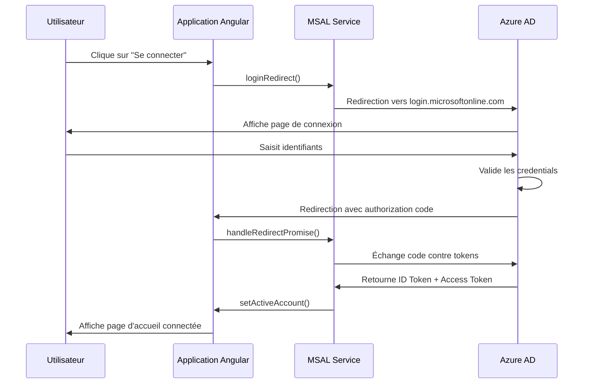
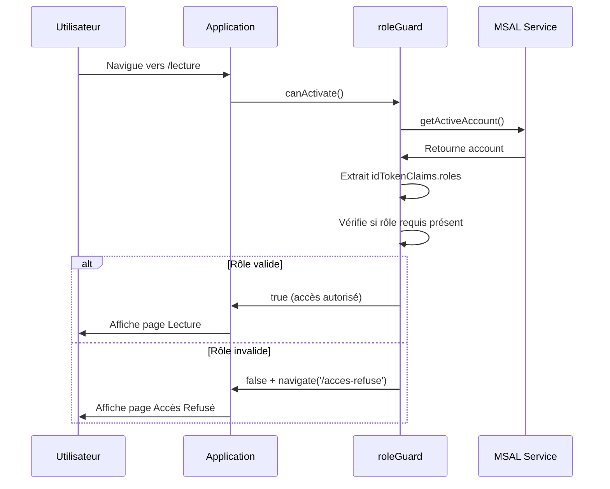

# 🔐 Demo MSAL - Application Angular avec Azure AD

Application de démonstration d'authentification Azure AD avec gestion des rôles utilisant MSAL (Microsoft Authentication Library).

## 📋 Table des matières

- [Vue d'ensemble](#vue-densemble)
- [Architecture](#architecture)
- [Flux d'authentification](#flux-dauthentification)
- [Gestion des rôles](#gestion-des-rôles)
- [Configuration](#configuration)
- [Installation](#installation)
- [Utilisation](#utilisation)
- [Structure du projet](#structure-du-projet)

## 🎯 Vue d'ensemble

Cette application démontre l'intégration d'Azure AD dans une application Angular standalone avec :
- ✅ Authentification via Azure AD (OAuth 2.0 / OpenID Connect)
- ✅ Gestion des rôles utilisateurs (RBAC)
- ✅ Protection des routes par authentification et rôles
- ✅ Navigation conditionnelle basée sur les permissions

## 🏗️ Architecture

```
┌─────────────────────────────────────────────────────────────┐
│                     Application Angular                      │
│                                                               │
│  ┌──────────────┐  ┌──────────────┐  ┌──────────────┐      │
│  │   Page       │  │   Page       │  │   Page       │      │
│  │  d'accueil   │  │   Lecture    │  │   Écriture   │      │
│  └──────────────┘  └──────────────┘  └──────────────┘      │
│         │                 │                  │               │
│         └─────────────────┴──────────────────┘               │
│                          │                                   │
│                   ┌──────▼──────┐                           │
│                   │    Guards   │                           │
│                   │  MsalGuard  │                           │
│                   │  roleGuard  │                           │
│                   └──────┬──────┘                           │
│                          │                                   │
│                   ┌──────▼──────┐                           │
│                   │ MSAL Service│                           │
│                   │  (Angular)  │                           │
│                   └──────┬──────┘                           │
└──────────────────────────┼──────────────────────────────────┘
                           │
                           │ OAuth 2.0 / OpenID Connect
                           │
                   ┌───────▼────────┐
                   │   Azure AD     │
                   │ (Entra ID)     │
                   │                │
                   │ - App Registration
                   │ - App Roles    │
                   │ - Users        │
                   └────────────────┘
```

## 🔄 Flux d'authentification

### 1. **Connexion utilisateur**



### 2. **Vérification des rôles**



### 3. **Déconnexion**

```
Utilisateur → logout() → MSAL Service → Azure AD
                                      ↓
                         Suppression session + tokens
                                      ↓
                         Redirection vers page login
```

## 🎭 Gestion des rôles

L'application utilise deux rôles définis dans Azure AD :

| Rôle | Nom technique | Description | Accès |
|------|--------------|-------------|--------|
| 📖 **Lecture** | `Task.Reader` | Consultation des documents | Page Lecture uniquement |
| ✏️ **Écriture** | `Task.Writer` | Création et modification | Pages Lecture + Écriture |

### Matrice des permissions

| Page | Anonyme | Task.Reader | Task.Writer |
|------|---------|-------------|-------------|
| Accueil | ✅ | ✅ | ✅ |
| Lecture | ❌ | ✅ | ✅ |
| Écriture | ❌ | ❌ | ✅ |

### Flux de vérification des rôles

```typescript
// Dans roleGuard
const requiredRoles = ['Task.Reader', 'Task.Writer'];
const userRoles = account.idTokenClaims?.roles || [];

// Vérifie si l'utilisateur a AU MOINS un des rôles requis
const hasRole = requiredRoles.some(role => userRoles.includes(role));

if (!hasRole) {
  router.navigate(['/acces-refuse']);
  return false;
}
return true;
```

## ⚙️ Configuration

### Prérequis
- Node.js 18+ 
- Angular CLI 18+
- Compte Azure avec accès à Azure AD

### Configuration de l'environnement

1. **Copier le fichier d'exemple :**
   ```bash
   cp src/environments/environment.example.ts src/environments/environment.ts
   ```

2. **Configurer vos identifiants Azure AD :**
   
   Éditez `src/environments/environment.ts` et remplacez :
   ```typescript
   export const environment = {
     production: false,
     azure: {
       clientId: 'VOTRE_CLIENT_ID',      // Client ID depuis Azure Portal
       tenantId: 'VOTRE_TENANT_ID',      // Tenant ID depuis Azure Portal
       redirectUri: 'http://localhost:4200'
     }
   };
   ```

3. **Récupérer vos identifiants Azure AD :**
   - Allez sur [Azure Portal](https://portal.azure.com)
   - **Microsoft Entra ID** → **App registrations** → Votre application
   - **Client ID** : Visible sur la page Overview
   - **Tenant ID** : Visible sur la page Overview
   - **Redirect URI** : Configuré dans Authentication

### Étapes d'installation

```bash
# 1. Cloner le projet
git clone <repository-url>
cd demo-msal

# 2. Installer les dépendances
npm install

# 3. Configurer l'environnement (voir ci-dessus)
cp src/environments/environment.example.ts src/environments/environment.ts
# Éditez environment.ts avec vos identifiants

# 4. Lancer l'application
ng serve

# 5. Ouvrir dans le navigateur
# http://localhost:4200
```

## 🚀 Utilisation

### 1. **Première connexion**

1. Cliquez sur **"Se connecter avec Azure AD"**
2. Saisissez vos identifiants Azure AD
3. Acceptez les permissions demandées
4. Vous êtes redirigé vers la page d'accueil

### 2. **Navigation**

**Si vous avez le rôle `Task.Reader` :**
- ✅ Accès à la page **Lecture**
- ❌ Pas d'accès à la page **Écriture**

**Si vous avez le rôle `Task.Writer` :**
- ✅ Accès à la page **Lecture**
- ✅ Accès à la page **Écriture**

### 3. **Déconnexion**

Cliquez sur le bouton **"Déconnexion"** dans le header ou sur la page d'accueil.

## 📁 Structure du projet

```
demo-msal/
├── src/
│   ├── app/
│   │   ├── guards/
│   │   │   └── role.guard.ts           # Guard de vérification des rôles
│   │   ├── pages/
│   │   │   ├── lecture/
│   │   │   │   └── lecture.component.ts  # Page Lecture (Reader + Writer)
│   │   │   ├── ecriture/
│   │   │   │   └── ecriture.component.ts # Page Écriture (Writer only)
│   │   │   └── acces-refuse/
│   │   │       └── acces-refuse.component.ts # Page Accès Refusé
│   │   ├── app.component.ts            # Composant principal
│   │   ├── app.config.ts               # Configuration Angular
│   │   ├── app.routes.ts               # Routes de l'application
│   │   └── auth-config.ts              # Configuration MSAL
│   └── main.ts
├── package.json
└── README.md
```

## 🔐 Sécurité

### Tokens utilisés

1. **ID Token** : Contient les informations utilisateur + rôles
2. **Access Token** : Utilisé pour les appels API (Microsoft Graph)

### Stockage des tokens

- **LocalStorage** : Tokens stockés localement (par défaut)
- **SessionStorage** : Alternative pour plus de sécurité (à configurer)

### Protection des routes

```typescript
// Routes protégées avec guards
{
  path: 'lecture',
  canActivate: [MsalGuard, roleGuard],
  data: { roles: ['Task.Reader', 'Task.Writer'] }
}
```

## 🐛 Dépannage

### Problème : "Aucun rôle assigné"

**Solution :**
1. Vérifiez dans Azure Portal → Enterprise Applications → Users and groups
2. Assignez un rôle à votre utilisateur
3. Déconnectez-vous et reconnectez-vous (pour obtenir un nouveau token)

### Problème : "Accès refusé" sur toutes les pages

**Solution :**
1. Vérifiez que les rôles dans `app.routes.ts` correspondent aux rôles Azure AD
2. Vérifiez les logs de la console : `[ROLES] Rôles bruts: [...]`
3. Assurez-vous que les noms de rôles correspondent exactement

### Problème : Redirection infinie

**Solution :**
1. Vérifiez que le Redirect URI dans Azure AD correspond à `http://localhost:4200`
2. Videz le cache du navigateur
3. Vérifiez les logs MSAL dans la console

## 📚 Ressources

- [Documentation MSAL Angular](https://github.com/AzureAD/microsoft-authentication-library-for-js/tree/dev/lib/msal-angular)
- [Azure AD App Roles](https://learn.microsoft.com/en-us/entra/identity-platform/howto-add-app-roles-in-apps)
- [Microsoft Identity Platform](https://learn.microsoft.com/en-us/entra/identity-platform/)

## 📝 Licence

MIT

## 👥 Auteur

Créé pour démonstration d'intégration Azure AD avec Angular.
