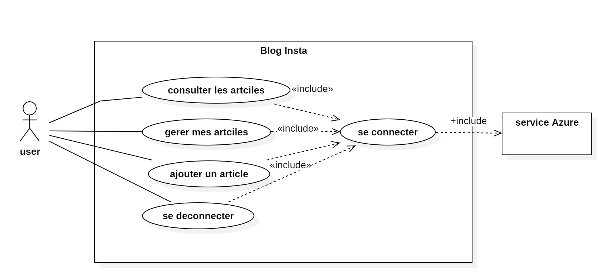
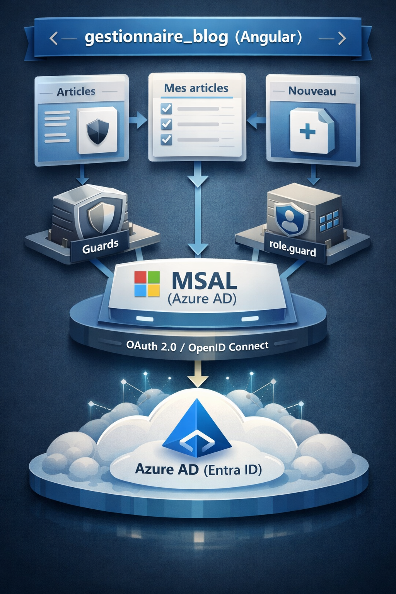
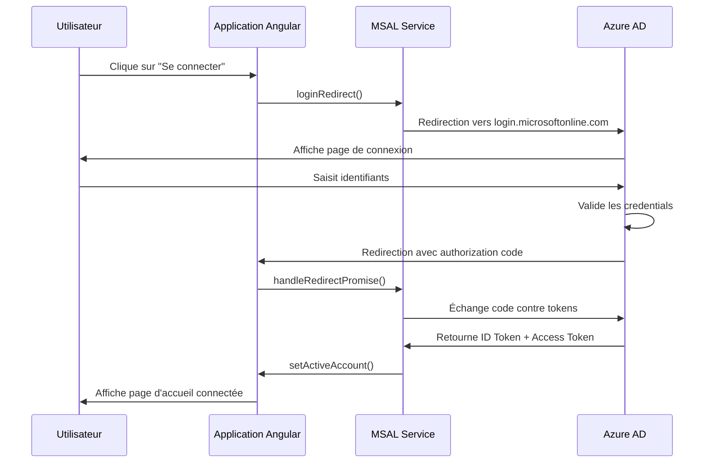
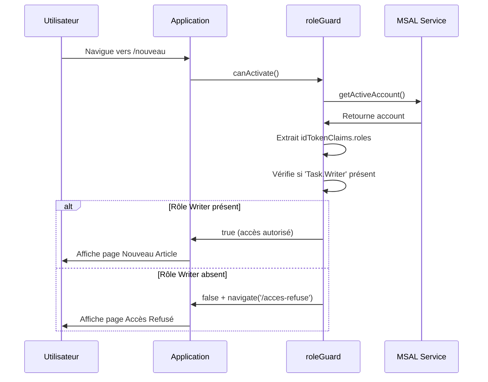

#  gestionnaire_blog — Angular + Azure AD + UI Moderne

Application de gestion de blog (gestionnaire_blog) avec authentification Azure AD, gestion des rôles, et une interface moderne avec icônes Font Awesome.

- Interface moderne et responsive (header sticky, login card agrandie et stylée)
- Icônes front intégrées (Font Awesome)
- Authentification Azure AD (MSAL)
- Gestion des rôles (lecture/écriture)
- Navigation conditionnelle


## Diagramme de cas d'utilisation



##  Architecture


- Interface moderne et responsive (header sticky, login card agrandie et stylée)
- Icônes front intégrées (Font Awesome)
- Authentification Azure AD (MSAL)
- Gestion des rôles (lecture/écriture)
- Navigation conditionnelle

##  Installation rapide

```bash
git clone <repository-url>
cd gestionnaire_blog
npm install
npm install @fortawesome/fontawesome-free
cp src/environments/environment.example.ts src/environments/environment.ts
# Modifiez environment.ts avec vos infos Azure
ng serve
# Ouvrez http://localhost:4200
```

##  Personnalisation UI

- **Login** : Carte centrée, large, avec icône lock et bouton Azure stylé
- **Header** : Icône blog, navigation avec icônes, nom utilisateur avec avatar, bouton déconnexion avec icône
- **Font Awesome** : Ajouté via npm, importé dans styles.css :
  ```css
  @import '@fortawesome/fontawesome-free/css/all.min.css';
  ```

##  Authentification & Rôles

- **Connexion** :
  - Bouton "Se connecter avec Azure AD" (icône Microsoft)
  - Redirection sécurisée via MSAL
- **Rôles** :
  - `Task.Reader` : Lecture seule
  - `Task.Writer` : Lecture + création/modification
- **Navigation** :
  - Accès conditionnel aux pages selon le rôle
  - Bouton "Nouveau" visible uniquement pour les writers

##  Structure du projet

```
gestionnaire_blog/
├── angular.json
├── package.json
├── README.md
├── tsconfig.app.json
├── tsconfig.json
├── tsconfig.spec.json
├── public/
│   └── preview-login.png
├── src/
│   ├── index.html
│   ├── main.ts
│   ├── server.ts
│   ├── styles.css
│   ├── app/
│   │   ├── app.component.css
│   │   ├── app.component.html
│   │   ├── app.component.spec.ts
│   │   ├── app.component.ts
│   │   ├── app.config.ts
│   │   ├── app.module.ts
│   │   ├── app.routes.server.ts
│   │   ├── app.routes.ts
│   │   ├── auth-config.ts
│   │   ├── guards/
│   │   │   └── role.guard.ts
│   │   ├── pages/
│   │   │   ├── articles.component.ts
│   │   │   ├── new-article.component.ts
│   │   │   └── acces-refuse/
│   │   │       └── acces-refuse.component.ts
│   │   ├── services/
│   │   │   └── posts.store.ts
│   └── environments/
│       └── environment.example.ts
```

##  Configuration Azure AD

1. Créez une app registration sur Azure Portal
2. Récupérez `clientId`, `tenantId`, configurez le `redirectUri`
3. Modifiez `src/environments/environment.ts` :
   ```typescript
   export const environment = {
     production: false,
     azure: {
       clientId: 'VOTRE_CLIENT_ID',
       tenantId: 'VOTRE_TENANT_ID',
       redirectUri: 'http://localhost:4200'
     }
   };
   ```

##  Utilisation

1. Lancez `ng serve`
2. Accédez à l'app, cliquez sur **Se connecter avec Azure AD**
3. Naviguez selon vos rôles (Accueil, Mes articles, Nouveau)
4. Déconnectez-vous avec le bouton en haut à droite

##  Dépendances principales

- Angular 18+
- @azure/msal-angular
- @fortawesome/fontawesome-free

##  Ressources utiles

- [MSAL Angular](https://github.com/AzureAD/microsoft-authentication-library-for-js/tree/dev/lib/msal-angular)
- [Font Awesome](https://fontawesome.com/)
- [Azure AD App Roles](https://learn.microsoft.com/en-us/entra/identity-platform/howto-add-app-roles-in-apps)

##  Flux d'authentification

### 1. **Connexion utilisateur**



### 2. **Vérification des rôles**



### 3. **Déconnexion**

```
Utilisateur → logout() → MSAL Service → Azure AD
                                      ↓
                         Suppression session + tokens
                                      ↓
                         Redirection vers page login
```

##  Gestion des rôles

L'application utilise deux rôles définis dans Azure AD :

| Rôle | Nom technique | Description | Accès |
|------|--------------|-------------|--------|
|  **Lecture** | `Task.Reader` | Consultation des documents | Page Lecture uniquement |
|  **Écriture** | `Task.Writer` | Création et modification | Pages Lecture + Écriture |

### Matrice des permissions

| Page | Anonyme | Task.Reader | Task.Writer |
|------|---------|-------------|-------------|
| Accueil | ✅ | ✅ | ✅ |
| Lecture | ✅  | ✅ | ✅ |
| Écriture | ❌ | ❌ | ✅ |

### Flux de vérification des rôles

```typescript
// Dans roleGuard
const requiredRoles = ['Task.Reader', 'Task.Writer'];
const userRoles = account.idTokenClaims?.roles || [];

// Vérifie si l'utilisateur a AU MOINS un des rôles requis
const hasRole = requiredRoles.some(role => userRoles.includes(role));

if (!hasRole) {
  router.navigate(['/acces-refuse']);
  return false;
}
return true;
```

##  Configuration

### Prérequis
- Node.js 18+ 
- Angular CLI 18+
- Compte Azure avec accès à Azure AD

### Configuration de l'environnement

1. **Copier le fichier d'exemple :**
   ```bash
   cp src/environments/environment.example.ts src/environments/environment.ts
   ```

2. **Configurer vos identifiants Azure AD :**
   
   Éditez `src/environments/environment.ts` et remplacez :
   ```typescript
   export const environment = {
     production: false,
     azure: {
       clientId: 'VOTRE_CLIENT_ID',      // Client ID depuis Azure Portal
       tenantId: 'VOTRE_TENANT_ID',      // Tenant ID depuis Azure Portal
       redirectUri: 'http://localhost:4200'
     }
   };
   ```

3. **Récupérer vos identifiants Azure AD :**
   - Allez sur [Azure Portal](https://portal.azure.com)
   - **Microsoft Entra ID** → **App registrations** → Votre application
   - **Client ID** : Visible sur la page Overview
   - **Tenant ID** : Visible sur la page Overview
   - **Redirect URI** : Configuré dans Authentication

### Étapes d'installation

```bash
# 1. Cloner le projet
git clone <repository-url>
cd demo-msal

# 2. Installer les dépendances
npm install

# 3. Configurer l'environnement (voir ci-dessus)
cp src/environments/environment.example.ts src/environments/environment.ts
# Éditez environment.ts avec vos identifiants

# 4. Lancer l'application
ng serve

# 5. Ouvrir dans le navigateur
# http://localhost:4200
```

##  Utilisation

### 1. **Première connexion**

1. Cliquez sur **"Se connecter avec Azure AD"**
2. Saisissez vos identifiants Azure AD
3. Acceptez les permissions demandées
4. Vous êtes redirigé vers la page d'accueil

### 2. **Navigation**

**Si vous avez le rôle `Task.Reader` :**
-  Accès à la page **acceuil**
-  Pas d'accès à la page **nouveau article**

**Si vous avez le rôle `Task.Writer` :**
-  Accès à la page **acceuil**
-  Accès à la page **mes artciles**
-  Accès à la page **nouveau article**

### 3. **Déconnexion**

Cliquez sur le bouton **"Déconnexion"** dans le header ou sur la page d'accueil.

##  Sécurité

### Tokens utilisés

1. **ID Token** : Contient les informations utilisateur + rôles
2. **Access Token** : Utilisé pour les appels API (Microsoft Graph)

### Stockage des tokens

- **LocalStorage** : Tokens stockés localement (par défaut)
- **SessionStorage** : Alternative pour plus de sécurité (à configurer)

### Protection des routes

##  Dépannage

### Problème : "Aucun rôle assigné"

**Solution :**
1. Vérifiez dans Azure Portal → Enterprise Applications → Users and groups
2. Assignez un rôle à votre utilisateur
3. Déconnectez-vous et reconnectez-vous (pour obtenir un nouveau token)

### Problème : "Accès refusé" sur toutes les pages

**Solution :**
1. Vérifiez que les rôles dans `app.routes.ts` correspondent aux rôles Azure AD
2. Vérifiez les logs de la console : `[ROLES] Rôles bruts: [...]`
3. Assurez-vous que les noms de rôles correspondent exactement

### Problème : Redirection infinie

**Solution :**
1. Vérifiez que le Redirect URI dans Azure AD correspond à `http://localhost:4200`
2. Videz le cache du navigateur
3. Vérifiez les logs MSAL dans la console

##  Ressources

- [Documentation MSAL Angular](https://github.com/AzureAD/microsoft-authentication-library-for-js/tree/dev/lib/msal-angular)
- [Azure AD App Roles](https://learn.microsoft.com/en-us/entra/identity-platform/howto-add-app-roles-in-apps)
- [Microsoft Identity Platform](https://learn.microsoft.com/en-us/entra/identity-platform/)

##  Licence

MIT

##  Auteur

Créé pour démonstration d'intégration Azure AD avec Angular.
